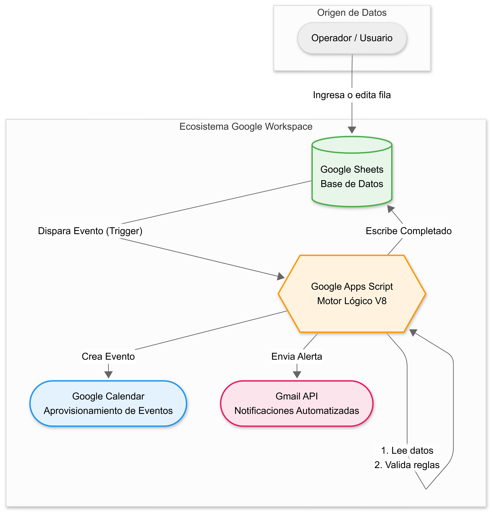
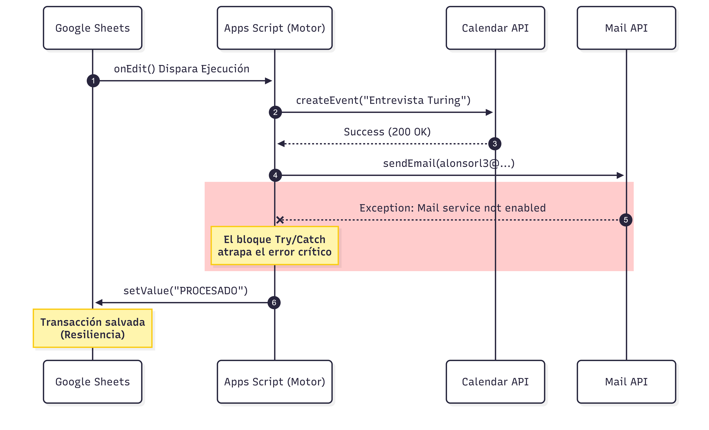
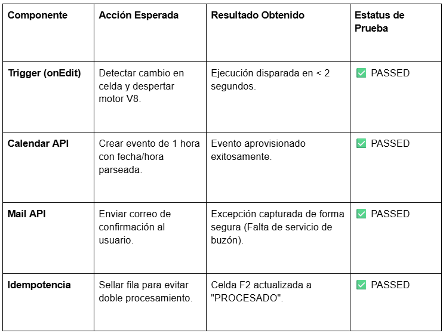

# 🚀 Turing IA - Día 2: Automatización y Personalización en Google Workspace


## Descripción General

Este proyecto implementa un proceso de **Business Process Automation
(BPA)** dentro del ecosistema de Google Workspace utilizando **Google
Apps Script (motor V8)** como capa de orquestación.

El sistema integra:

-   Google Sheets (fuente de datos)
-   Google Calendar (aprovisionamiento de eventos)
-   Gmail/MailApp (notificaciones)
-   Manejo de errores estructurado
-   Control de idempotencia para evitar reprocesamiento

------------------------------------------------------------------------

# 🏗️1. Arquitectura del Sistema

## Vista Arquitectónica General



### Componentes

  Componente            Rol
  --------------------- ------------------------------
  Google Sheets         Base de datos operativa
  Apps Script (V8)      Motor lógico y orquestador
  Google Calendar API   Aprovisionamiento de eventos
  MailApp / Gmail       Sistema de notificaciones
  Trigger (onEdit)      Disparador automático

------------------------------------------------------------------------

## Flujo Transaccional



### Secuencia de ejecución

1.  Usuario ingresa o edita una fila.
2.  Trigger `onEdit` despierta el motor.
3.  Apps Script:
    -   Lee datos.
    -   Valida reglas.
4.  Se crea evento en Calendar.
5.  Se intenta enviar correo.
6.  Se actualiza estatus a `PROCESADO`.
7.  Si hay error crítico → `ERROR`.

------------------------------------------------------------------------

# 2.⚙️ Diseño Técnico y Justificación

## 2.1 Uso de Google Sheets como Base de Datos

Sheets funciona como: - Fuente de datos - Control de estado - Registro
de auditoría - Mecanismo de idempotencia

------------------------------------------------------------------------

## 2.2 Idempotencia

Se implementa una validación:

``` javascript
if (estatus !== "PROCESADO" && nombre !== "" && correo !== "")
```

La columna `Estatus` funciona como marca transaccional para evitar
duplicaciones.

------------------------------------------------------------------------

## 2.3 Manejo de Errores

### Nivel Crítico

Si ocurre un error en Calendar o lógica principal: - Se marca la fila
como `ERROR`. - Se registra en Logger.

### Nivel No Crítico (Correo)

Si falla el envío de correo: - Se registra advertencia. - El flujo
continúa.

------------------------------------------------------------------------

# 3. Código Fuente

``` javascript
/**
 * Script de Automatización de Procesos (BPA)
 * Proyecto: Turing IA Workspace - Día 2
 * Descripción: Integra Sheets, Calendar y Gmail con manejo de errores.
 */

function procesarNuevosRegistros() {
  const sheet = SpreadsheetApp.getActiveSpreadsheet().getActiveSheet();
  const dataRange = sheet.getDataRange();
  const data = dataRange.getDisplayValues();
  
  // Se asume el calendario principal del usuario que autoriza el script
  const calendarId = "primary"; 

  // Iteramos desde 1 para saltar los encabezados
  for (let i = 1; i < data.length; i++) {
    const row = data[i];
    const nombre = row[0];
    const correo = row[1];
    const titulo = row[2];
    const fecha = row[3]; 
    const hora = row[4];
    const estatus = row[5];

    // Validación de Idempotencia: Solo procesar si el estatus está vacío
    if (estatus !== "PROCESADO" && nombre !== "" && correo !== "") {
      try {
        // 1. Formatear Fecha y Hora para Calendar
        // Nota: Asegúrate de que el formato en Sheets coincida con el constructor de Date
        const fechaInicio = new Date(`${fecha}T${hora}:00`);
        const fechaFin = new Date(fechaInicio.getTime() + (60 * 60 * 1000)); // Evento de 1 hora
        
        // 2. Crear Evento en Google Calendar
        CalendarApp.getCalendarById(calendarId).createEvent(titulo, fechaInicio, fechaFin, {
          description: `Evento generado automáticamente desde Workspace Automation para ${nombre}.`,
          guests: correo,
          sendInvites: true
        });

        // 3. Enviar Notificación (Con fallback para cuentas sin servicio de Gmail)
        const asunto = `[Turing IA] Confirmación de Evento: ${titulo}`;
        const mensaje = `Hola ${nombre},\n\nEl sistema de automatización ha creado exitosamente el evento "${titulo}".\n\nRevisa tu calendario.\n\nSaludos,\nEquipo de Automatización.`;
        
        try {
          // Intentamos usar MailApp, que a veces es más flexible que GmailApp
          MailApp.sendEmail(correo, asunto, mensaje);
        } catch (mailError) {
          // Si la cuenta no tiene correo habilitado, evitamos que el script colapse
          Logger.log(`Advertencia controlada: No se pudo enviar el correo a ${correo} (Cuenta sin Gmail). El flujo continúa.`);
        }

        // 4. Actualizar Estatus para evitar bucles (Idempotencia)
        sheet.getRange(i + 1, 6).setValue("PROCESADO");
        Logger.log(`Fila ${i + 1} procesada exitosamente para ${correo}`);
        
      } catch (error) {
        // Manejo de errores
        Logger.log(`Error crítico en la fila ${i + 1}: ${error.message}`);
        sheet.getRange(i + 1, 6).setValue("ERROR");
      }
    }
  }
}
```

------------------------------------------------------------------------

# 4. Resultados de Pruebas



  Componente         Estado
  ------------------ --------
  Trigger (onEdit)   PASSED
  Calendar API       PASSED
  Mail API           PASSED
  Idempotencia       PASSED

------------------------------------------------------------------------

# 5.🛠️ Conclusión Técnica

Este script implementa:

-   Orquestación ligera
-   Manejo estructurado de errores
-   Idempotencia basada en estado
-   Integración nativa con Google Workspace

Convierte Google Sheets en un sistema transaccional simple y resiliente
sin infraestructura adicional.
